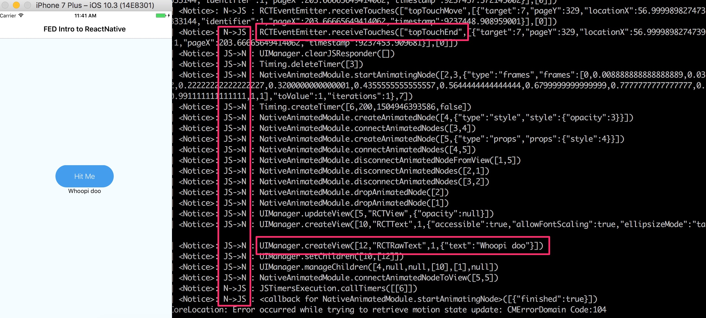
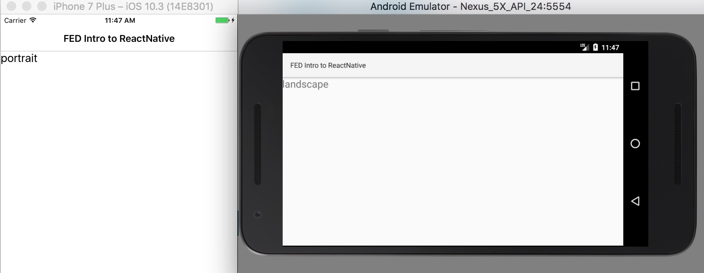
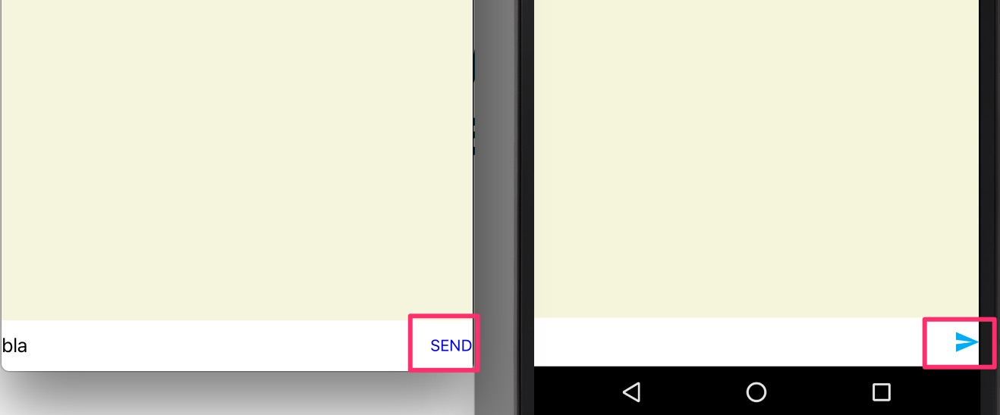
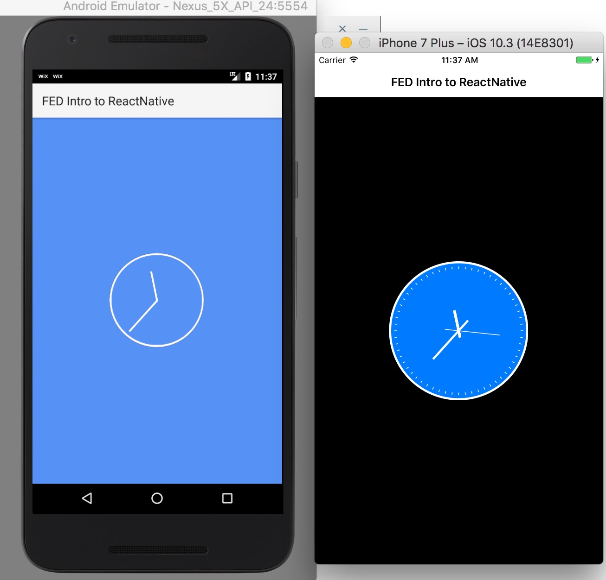
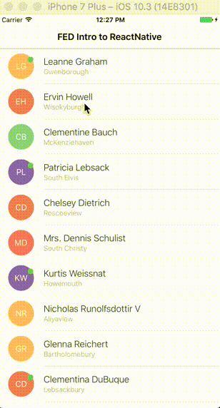

### FED Intro to ReactNative

Checkout the slides [here](https://slides.com/ofird/intro-to-react-native/live#/).

### Demos:

#### Demo 1 - Debugging the bridge

```sh
git checkout step-1
npm run start
react-native run-ios
//or
react-native run-android
```



#### Demo 2 - Expose Native Functionality in Javascript

```sh
git checkout step-3
npm run start
react-native run-ios
//or
react-native run-android
```



#### Demo 3 - Different Javascript Implementation For Different Platforms

```sh
git checkout step-4-send-input
npm run start
react-native run-ios
//or
react-native run-android
```



#### Demo 4 - Using Native UI Components

```sh
git checkout step-6-native-ui-components
npm run start
react-native run-ios
//or
react-native run-android
```



#### Demo 5 - Real Life App

```sh
git checkout step-5-contact-posts
npm run start
react-native run-ios
//or
react-native run-android
```


